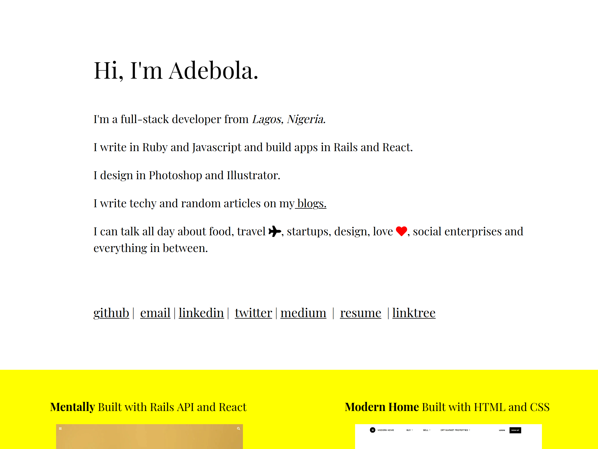

# Portfolio

> This is my personal portfolio - a collection of some of my favorite projects.Built in React.



## Built With

- React
- NPM
- Cloudinary for serving optimized immages

## Live

[Live Link](https://elegant-borg-4081b7.netlify.com/#)

## Getting Started

**To get started, follow the instructions below**

To get a local copy up and running follow these steps.

- git clone this repo

```
git clone https://github.com/onedebos/portfolio-in-react.git
```


- cd into the folder
- run

```
npm install
```

to install all packages. then run

```
npm start
```

- to start the app in the browser.

### Prerequisites

- Node

## Authors

👤 **Adebola**

- Github: [@githubhandle](https://github.com/onedebos)
- Twitter: [@twitterhandle](https://twitter.com/debosthefirst)
- Linkedin: [linkedin](https://www.linkedin.com/in/adebola-niran/)
- Portfolio: [Website](https://elegant-borg-4081b7.netlify.com/#)

## 🤝 Contributing

Contributions, issues and feature requests are welcome!

Feel free to check the [issues page](issues/).

## Show your support

Give a ⭐️ if you like this project!

## 📝 License

This project is [MIT](lic.url) licensed.
